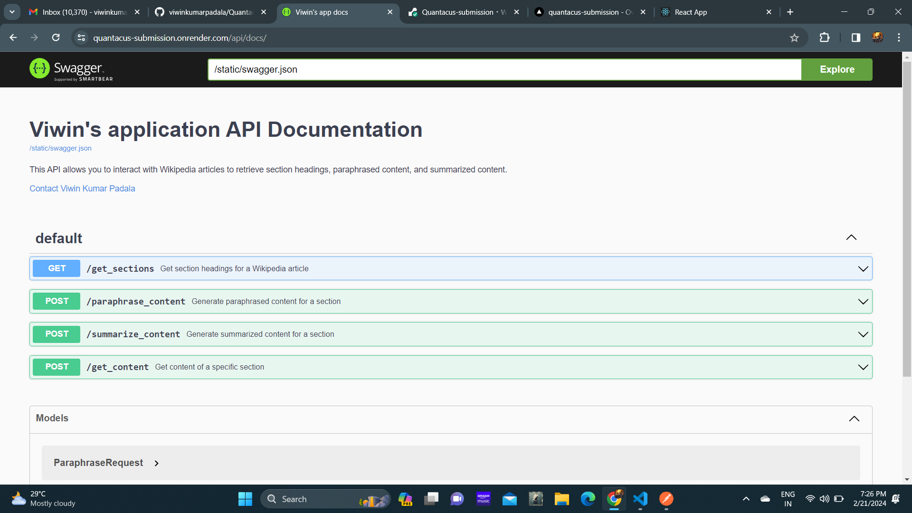
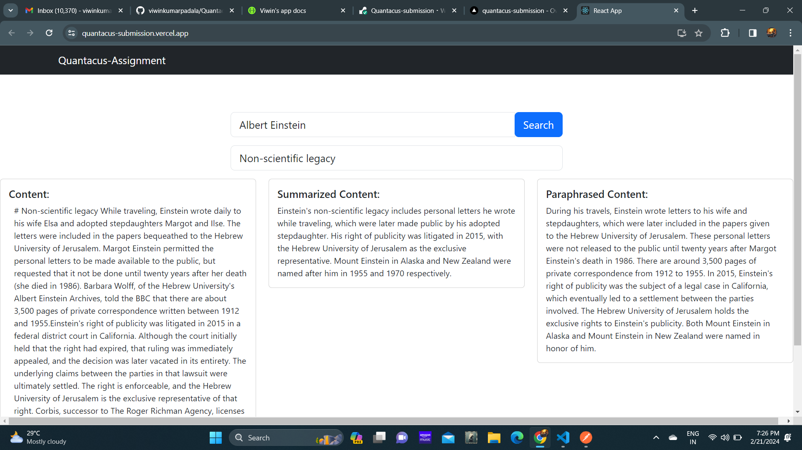
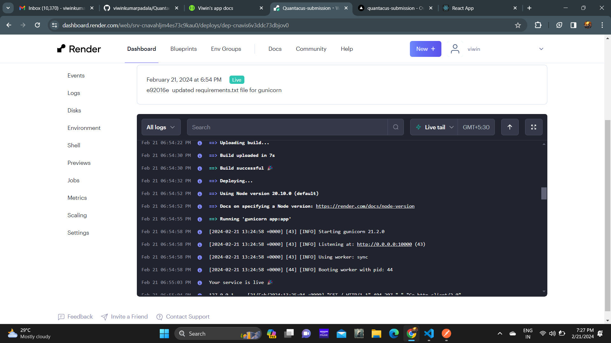
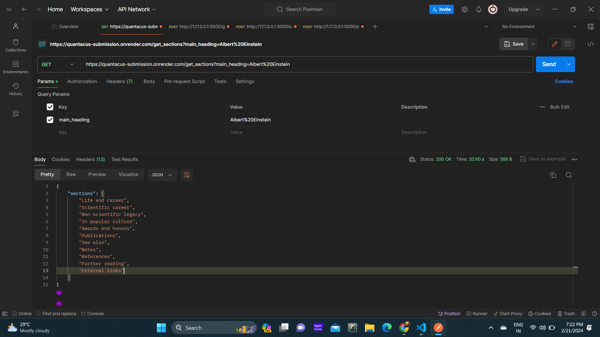
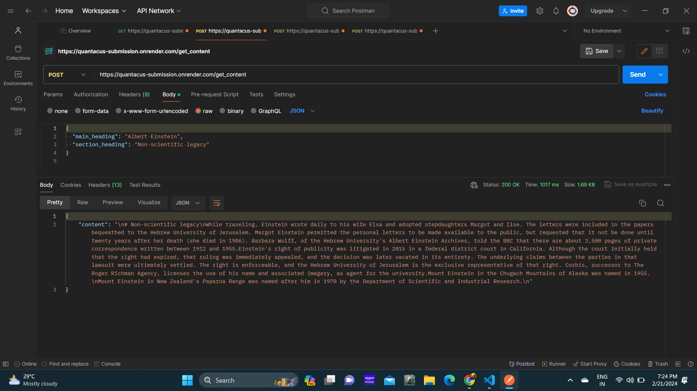
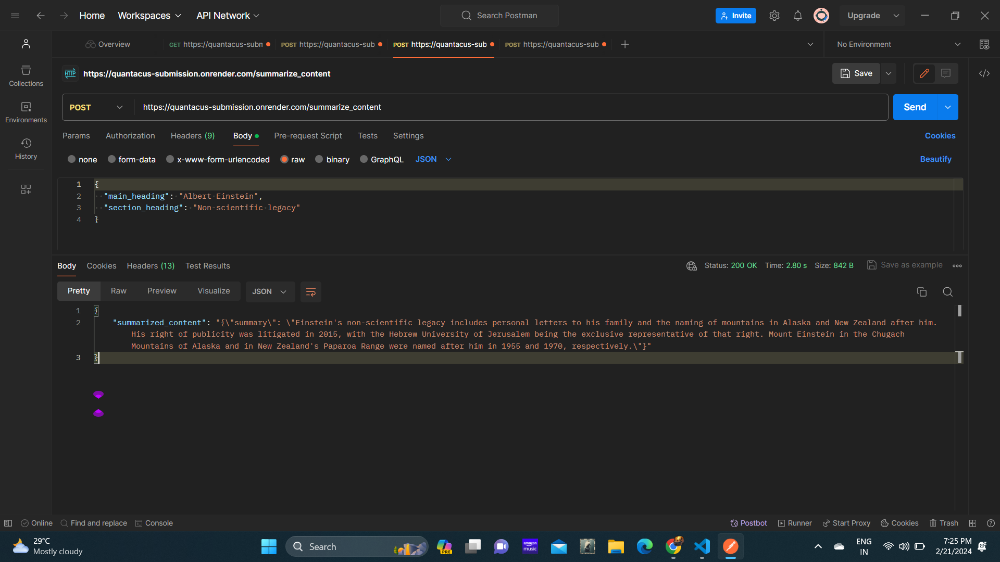
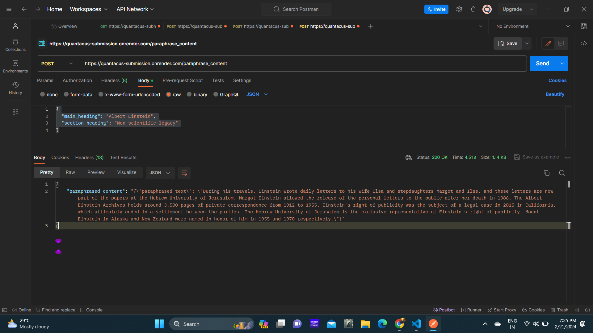

# Quantacus Submission

## Description

This repository contains the code for the Quantacus submission project. It consists of both backend and frontend components designed to interact with Wikipedia articles, perform text summarization and paraphrasing, and provide an API documentation using Swagger.

## Technologies Used

- **Backend:**
  - Flask
  - OpenAI
  - Wikipedia-API
  - Swagger

- **Frontend:**
  - ReactJS
  - React-Bootstrap

## API Documentation

You can access the API documentation [here](https://quantacus-submission.onrender.com/api/docs/).

- sample:


## Hosted Website

The hosted website is available [here](https://quantacus-submission.vercel.app/).

- sample:


## Hosted Server

The hosted server can be accessed [here](https://quantacus-submission.onrender.com).

- sample:


## Routes

### Get Sections Route

This route retrieves section headings for a given Wikipedia article.

- Route: `/get_sections?main_heading=Albert%20Einstein`

- output:


### Get Content Route

This route retrieves content for a specific section of a Wikipedia article.

- Route: `/get_content`
- Body:
  ```json
  {
    "main_heading": "Albert Einstein",
    "section_heading": "Non-scientific legacy"
  }

-output:


### Get Summarised Content Route

This route retrieves the summary of content for a specific section of a Wikipedia article.

- Route: `/summarize_content`
- Body:
  ```json
  {
    "main_heading": "Albert Einstein",
    "section_heading": "Non-scientific legacy"
  }

- output:


### Get Paraphrased Content Route

This route retrieves the Paraphrased content for a specific section of a Wikipedia article.

- Route: `/paraphrase_content`
- Body:
  ```json
  {
    "main_heading": "Albert Einstein",
    "section_heading": "Non-scientific legacy"
  }

- output:



## Steps to Use the Repository

### Clone the repository
git clone https://github.com/viwinkumarpadala/Quantacus-submission.git

### Backend

1. Navigate to the backend directory: `cd quantacus-submission/backend`.
2. Activate the virtual environment: `venv/scripts/activate`.
3. Run the Flask application: `python -m flask --app app.py run`.

### Frontend

1. Navigate to the frontend directory: `cd quantacus-submission/frontend`.
2. Install dependencies: `npm install`.
3. Start the frontend server: `npm start`.


## Author
Padala Viwin Kumar
